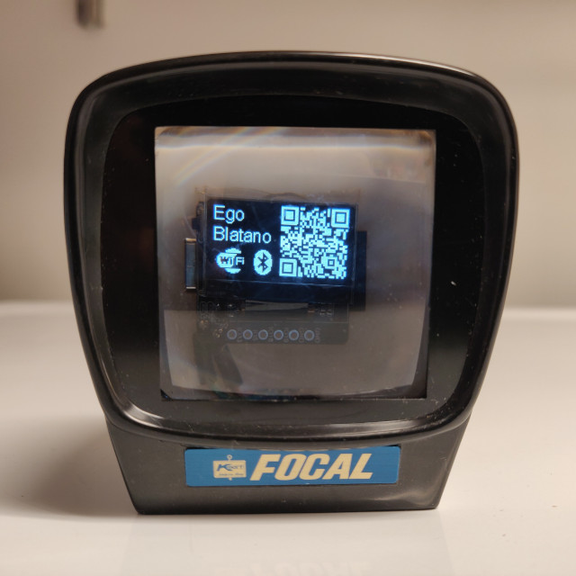
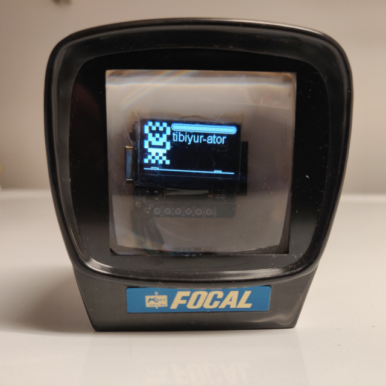

# Blatano - A mid-21st Century Modern 

 

Blatano is a mid-21st Century Modern inhabitant of the boundary
between our physical and digital space. It knows only what it senses
in the environment around it: it recognizes fellow digital denizens by
their electronic, radio, and digital trails. For our benefit, it shows
their names and their digital portraits.

Eschewing Dr. Seuss's "Thing 1, Thing 2" approach, Blatano uses a way
of naming entities that distills all its knowledge down into a few
bits of information, which it then further illustrates for us as a
drawing and a name. Blatano also has a
sense of location, and draws its view of the radio horizon along the
bottom of the display. The drawings may not resemble you, your
landscape, or your smart refrigerator, but if you see a name and robot
drawing consistently associated with your presence, rest assured it is
an accurate representation of how Blatano perceives you. The size of the drawing
The sense of drawing indicates the distance from Blatano as well.

In Rich Gold's "Little Computer People," we are outside the
computation, looking at the homunculus in the computer. With Blatano,
the homunculus is looking at us.

Blatano has a built-in set of criteria for deciding what is unique and
what is variation, discarding the most random and keeping a few key
points. These criteria let Blatano distinguish things dimly, such the
difference between humans and service robots. Although it can
recognize the difference, it does not attribute any importance to it
other than as a distinguishing characteristic! Still, it contributes
to Blatano's knowledge and thus the name and the digital portrait.

It would be interesting to hear if you can strongly associate any 
name or set of names with a person, or other entity. For my part,
I believe Blatano calls my refrigerator "Partare-oid" and I think it has a cute
face.

Since Blatano's electromagnetic vision is not as rich as ours, it
sometimes confuses what we would recognize as two distinct entities,
but Blatano simply cannot tell them apart.

Blatano could to distinguish entities better with more senses, and
with a bit of work on learning across them. Easy additions are a
light sensor to know when it is dark, Lidar distance to know if something
is approaching, acceleration to determine orientation, an internal 
clock for tracking time, even a GPS!  

Feel free to experiment and add some of these senses.

Once Blatano has more senses, we'll need to figure out how to associate values across dimensions and name and 
cluster objects at that level instead of using a simple naming scheme for their values. Some sort of clustering
or embedding? Who knows, maybe you?

Enjoy Blatano.

---

# Behind the Scenes
Blatano converts the Bluetooth and WiFi packets it can read into an small
amount of data, an information summary with everything it can remember
about the entity it is hearing from.

There are other projects that use ESP32 BLE Scanner, but all have
different aims, though the tech stack is similar.

I started with the ESP32 Bluetooth Scanner, from Moononournation's
Arduino BLE Scanner GitHub repo, plus a whole lot more approaches
tried in the rest of the web, links below.

- Pwnagochi: crack wifi, but with a drawn-character face
- Hash Monster: crack wifi
- CovidSniffer: nearby covid beacon counter

# Sensing

BLE entity sensing for the ESP32 all comes from the same place. There
are a variety of processing approaches, but all are the same
fundamentally: loop through the BLE advertisements of devices that
want to answer your query; decide what fields to keep and what ones to
discard, and which to pick apart with bit tweezers; decide how long
you keep data or counts in memory, given that iPhones change their
Bluetooth MAC address every 20 minutes.

The Landscape at the bottom of the screen is an abbreviated 2.4 GHz WiFi
channel spectrum graph showing the signals on each channel. Multiple
APs of the same channel with similar signal strength aren't distinguishable,
but ones of different strength are. This landscape could represent a place.
Blatano does not make use of this sense of
place, but coupled with memory of the entity ids (v.i.), could start associating
them with places.

# Representation

Recognized entities are given a 32-bit number, which is then the
"memory" of the entity. The processes that distill the sense data
into the "entity id" are necessarily lossy. 

The display and naming
are also lossy so, Blatano's representation is richer than it can show us,
but poorer than what it has sensed. The current entity recognition and representation
is based on a simple ad hoc algorithm with hand-tuned features. An unsupervised
ML clusterer should also be possible, given the constraints that there is 100% uniform
randomness injected at roughly 20 minute timescales, so distinguishing two entities across
such time boundaries will be difficult without some explicit feature or enough data
to learn over large time scales. 

For now, we use numeric features and a simple hash, and each feature used is hand tuned
to obtain the least number of random elements. The objects already have independent
references from the BLE scan, so we have already separated them, but our task is to give each
recognized object a different name, even if we can only tell that they are different but not in what way.
For example, two objects with different random mac addresses and the same signal strength are
otherwise indistinguishable, so we simply give them a serial number based on when they were
encountered in the BLE scan. Blatano simply confuses one for the other, but knows there are two - or more!

To turn the sensory data into a 32-bit number, I used the CRC32C
algorithm to turn any amount of data into a 32-bit number. In this
step, we also discard information. The process of hashing a bigger
piece of data into a 32-bit number is necessarily lossy. We use this "entity id"
as the entire memory representation of an object. From there, we can 
then generate the name and the drawing. 

# Naming

For naming, I had the idea to generate robot names from a syllabary
and three or four syllables and suffixes, plus memories of Stanislaw
Lem's novels, in English translation for the suffixes.

I created a Python hack to generate a robot name from a 32-bit number.
I started with the Japanese consonants and vowels, and added and
removed letters and did other random hacks until I liked the names it
produced. Then I made it possible to calculate without lookup tables,
and moved it to C and added it to into the BLE Scanner project. The
names are robotic enough, and although the input is still only a
32-bit number, it uses only about 28.5 bits, or 8% coverage of 32-bit
numbers with names. We can cheekily explain this as "our names cannot
be rendered exactly in your alphabet."

I converted the Python hack to C, then into the Arduino toolchain, and
simplified it. Test code is still present, but #if'd out.

# Drawing

For drawing, Blatano follows an old design from a website no longer
maintained, but available through Brewster Kahle's Wayback Machine of
Archive.org, and through a few links to that page. The drawing
algorithm is due to Dave Bollinger of DaveBollinger.com in 2008, and
the links are available in the references. I had several false starts
trying to convert a 32-bit CRC32C hash code into an image, but had a
basic idea to start with head, arms, tors, and legs specified with 8
bits. I tried drawing with Python Turtle Graphics to experiment with
multi-bit variation in head shape and eye size, but eventually
concluded the approach was too cumbersome.

I had found a few approximations of the GitHub icon drawer, and some
CSS hacks, and Pagan was closest to what I needed, but none were
appropriate for tiny 64x64 square monochrome pixels. Eventually I
found Jake.dk's copy of Dave Bollinger's Pixel Robot Generator. It's a
clever hack to generate passable robots from a 24-bit number by using
symmetry, a simple template, and a lightweight edge-tracing
algorithm. Unfortunately, the code from Jake.dk itself is not useful
to me (ancient C#), but the algorithm is appealing and so I decided to keep looking for the original
Dave Bollinger code. A 4-byte code giving 4-part robots would be a
better fit than the 3-part robot, but the loss is not that great, and
2²⁴ robot drawings ought to be enough for anybody.

The robots show in small, medium, and large sizes, depending on the
received signal strength. The theoretically useful range for
BLE is -105 to -60dBm. Although we have five sizes that will fit the screen,
only the largest three are useful, so after a brief population survey, I picked
the range -90 to -80 as medium, with above and below falling to the other two sizes.
I collected some data and used Python pandas to analyze it, and decided on the bins.

# Drawing Implementation
Here are samples copied from
Jake.dk's copy of Dave Bollinger's illustrations, via Archive.org
WayBack Machine (Yay, Brewster!) See references for links to originals.

## All robot parts, 0x000000 to 0xffffff by increments of 0x010101

The above diagram Dave Bollinger contains all 256*3 robot parts, so just reading those as is and drawing the dots 5x isn't necessarily a bad approach, bitblt notwithstanding. On the other hand, drawing each bit in the template as a 5x square isn't hard either, and there is no need to make a big table or store an image on Flash.

## Some sample robots

These robots in the image also from Dave Bollinger are 7x11 pixels, and we have a roughly 64x64 pixel area to fill. Scaling 5x to 35x55 seems the maxfit. They’re visible down to 1px but really only 3, 4, and 5 are pleasant. 

## PixelRobots Processing code
I finally found Dave Bollinger's original Processing code on the WayBack Machine
link from Jake.dk. It's copied into the docs/PixelRobots/ directory.
If you remove one framerate config setting, it runs in Processing today.

I converted it to generate just one robot instead of drawing a tiled panorama
of multiple sizes, and you can see that code in docs/PixelRobotsTest/ directory.
From here, it was a straight shot porting the Java code to Arduino C++!

# Physical Embodiment
I wanted some type of Brazil-like TV display with a magnifying lens in
front. During the project, some small 3D printed TV holders for ESP32
with display turned up, but since I still can't do 3D printing, I
can't go that route — it reduces to a previously unsolved
problem.

I ordered some surplus lenses, trying to find some of the surplus
companies I remembered from years (decades?) ago. Edmund is reliable
but pricey, but I found a place called Surplus Shed that had a good
deal on small viewfinder-like lenses. When the credit card charge
came, I was sad to see the name of the seller was Wollensak. I didn't
wind up using the lenses, and I hope nobody ever wants a viewfinder
lens for some old camera that time forgot and Wollensak still had in stock.

I settled on a 35mm slide viewer, Focal brand, from a craft seller.
It had battery damage inside. 

I tried a variety of mounting solutions and settled on a few small cuts
to fit boards and connectors through. I added an externally-accessible USB-C
connector for power, with a matching cable, designed for single use. 

Photos of Blatano are shown at the top of the page.

# Screen Samples
Here are close-ups of OLED displays showing a variety of robots.

  
  

# Development
Development took place on Ubuntu Linux on Intel CPU, Arduino IDE 1.8.15, Emacs 36.3, git and GitHub. Some initial algorithm development was done in Python, Processing (Java), and C before final Arduino C++ coding began. Data analysis was done in Python.

# Compilation
Use Arduino IDE, ESP32, Huge App 3MB / 1MB Spiffs / No OTA.

The main files are
- `Blatano.*`: The main Blatano application
- `PixelRobot.*`: Drawing PixelRobot, containing Dave Bollinger's code.
- `drawing.*`: Adapter for drawing layer for PixelRobot to ESP32 OLED SSD1306 library
- `names.*`: Robot name algorithm
- Remaining `*.h` files: XBM images for icons and QR code
- `docs`: experiments and orignal code before Arduino version

# Project History
Aside from the commentary above, the code history back to my last editing hacks testing out the Arduino BLE Scanner example code, is best summarizzed here: https://github.com/leighklotz/blatano/pulls?q=is%3Apr

# References

These references consist of a near record of my browsing
history during this project, plus a few select links.

- [Scuttle Blatano](https://scuttle.klotz.me/search/all/Blatano)
- [Arduino](https://arduino.cc)
- [Adafruit](https://adafruit.com)
- [Espressif OSS](https://github.com/espressif)
- [Pwnagotchi](https://pwnagotchi.ai/)
- [Little Computer People](https://en.wikipedia.org/wiki/Little_Computer_People)
- [Processing](https://processing.org/download/)
- [Arduino ESP32 Adafruit SSD1306 - Google Search](https://www.google.com/search?q=arduino+esp32+adafruit+ssd1306)
- [ESP32 OLED Display with Arduino IDE | Random Nerd Tutorials](https://randomnerdtutorials.com/esp32-ssd1306-oled-display-arduino-ide/)
- [In-Depth: Interface OLED Graphic Display Module with ESP32](https://lastminuteengineers.com/oled-display-esp32-tutorial/)
- [Adafruit SSD1306](https://github.com/adafruit/Adafruit_SSD1306)
- [ESP8266 and ESP32 OLED driver for SSD1306 displays - Arduino Reference](https://www.arduino.cc/reference/en/libraries/esp8266-and-esp32-oled-driver-for-ssd1306-displays/)
- [LILYGO® TTGO T LITE W5500 ESP32 SSD1306 0.96 - AliExpress](https://pt.aliexpress.com/item/4001252326111.html)
- [ESP8266 OLED SSD1306](https://github.com/Xinyuan-LilyGO/LilyGo-W5500-Lite/tree/master/libdeps/esp8266-oled-ssd1306)
- [ThingPulse esp8266-oled-ssd1306](https://github.com/ThingPulse/esp8266-oled-ssd1306)
- [ESP32_BLE_Arduino BLE_Scan.ino](https://github.com/nkolban/ESP32_BLE_Arduino/blob/master/examples/BLE_scan/BLE_scan.ino)
- [12.04 - How to check bluetooth status via terminal - Ask Ubuntu](https://askubuntu.com/questions/144655/how-to-check-bluetooth-status-via-terminal)
- [bluetooth device scan mode esp32 - Google Search](https://www.google.com/search?q=bluetooth+device+scan+mode+esp32)
- [Nano ESP32 BLE Scanner : 14 Steps (with Pictures) - Instructables](https://www.instructables.com/Nano-ESP32-BLE-Scanner/)
- [Arduino_BLE_Scanner.ino](https://github.com/moononournation/Arduino_BLE_Scanner/blob/master/Arduino_BLE_Scanner.ino)
- [Bluetooth Low Energy (BLE) identifier reference | diyActive](https://reelyactive.github.io/ble-identifier-reference.html)
- [Welcome to The Public Listing For IEEE Standards Registration Authority](https://regauth.standards.ieee.org/standards-ra-web/pub/view.html#registries)
- [00:60:80](https://macaddresschanger.com/bluetooth-mac-lookup/00%3A60%3A80)
- [Arduino ESP32 WiFi Scanner](https://github.com/espressif/arduino-esp32/blob/master/libraries/WiFi/examples/WiFiScan/WiFiScan.ino)

- [Neologisms of Stanislaw Lem - Wikibooks, open books for an open world](https://en.wikibooks.org/wiki/Neologisms_of_Stanislaw_Lem)
- [Harald Bluetooth - Wikipedia](https://en.wikipedia.org/wiki/Harald_Bluetooth)
- [Adafruit_SSD1306](https://github.com/adafruit/Adafruit_SSD1306)
- [bip-0039.mediawiki](https://github.com/bitcoin/bips/blob/master/bip-0039.mediawiki)
- [CircularBuffer](https://github.com/rlogiacco/CircularBuffer)
- [Arduino memcpy and memmove | Delft Stack](https://www.delftstack.com/howto/arduino/arduino-memcpy/)
- [Arduino BLE BLE Device Advertised Service UUID Count](https://www.arduino.cc/en/Reference/ArduinoBLEBLEDeviceadvertisedServiceUuidCount)
- [Core V4.0.pdf](https://www.libelium.com/forum/libelium_files/bt4_core_spec_adv_data_reference.pdf)
- [arduino non-cryptographic hash - Google Search](https://www.google.com/search?q=arduino+non-cryptographic+hash)
- [The Hash Monster: ESP32 Tamagotchi For WiFi Cracking : esp32 Reddit](https://www.reddit.com/r/esp32/comments/ilrulf/the_hash_monster_esp32_tamagotchi_for_wifi/)
- [The Hash Monster: ESP32 Tamagotchi For WiFi Cracking — Telescope](https://telescope.ac/petazzoni/the-hash-monster-esp32-tamagotchi-for-wifi-cracking)
- [CovidSniffer / Michael Schmidl](https://gitlab.com/mschmidl/covidsniffer/-/blob/master/main/app_main.c)
- [M5_SSID_scanner_collector](https://github.com/elkentaro/M5_SSID_scanner_collector)
- [Data Processing - Arduino Reference](https://www.arduino.cc/reference/en/libraries/category/data-processing/)
- [Lightweight Cryptography Primitives: Performance on 32-bit platforms](https://rweather.github.io/lightweight-crypto/performance.html)
- [aead - Google Search](https://www.google.com/search?q=aead&oq=aead&aqs=chrome..69i57j69i59l2j69i60l5.704j0j7&sourceid=chrome&ie=UTF-8)
- [ArduinoSpritzCipher](https://github.com/abderraouf-adjal/ArduinoSpritzCipher)
- [Arduino_CRC32](https://github.com/arduino-libraries/Arduino_CRC32)
- [Cyclic redundancy check - Wikipedia](https://en.wikipedia.org/wiki/Cyclic_redundancy_check#Application)
- [CircularBuffer](https://github.com/rlogiacco/CircularBuffer)
- [Arduino - ArduinoBLE](https://www.arduino.cc/en/Reference/ArduinoBLE)
- [Adafruit_SSD1306](https://github.com/adafruit/Adafruit_SSD1306)
- [CircularBuffer.ino](https://github.com/luisllamasbinaburo/Arduino-CircularBuffer/blob/master/examples/CircularBuffer/CircularBuffer.ino)
- [Arduino_CRC32](https://github.com/arduino-libraries/Arduino_CRC32)
- [pixel art 8 bit robot - Google Search](https://www.google.com/search?q=pixel+art+8+bit+robot)
- [free robot icon 32 pixel - Google Search](https://www.google.com/search?q=free%20robot%20icon%2032%20pixel)
- [Robot Icons - 23,270 free vector icons](https://www.flaticon.com/free-icons/robot)
- [python draw small robot icons](https://www.google.com/search?q=python+draw+small+robot+icons)
- [Robot icons | Stock vector | Colourbox](https://www.colourbox.com/vector/robot-icons-vector-31838991)
- [Turtle examples](https://michael0x2a.com/blog/turtle-examples)
- [Turtle — Turtle graphics — Python 3.9.6 documentation](https://docs.python.org/3/library/turtle.html)
- [Practical Cryptography](http://practicalcryptography.com/cryptanalysis/letter-frequencies-various-languages/english-letter-frequencies/)
- [Python random.choice() to choose random item from list, String, array](https://pynative.com/python-random-choice/)
- [python convert strings into sets of characters - Stack Overflow](https://stackoverflow.com/questions/13782725/python-convert-strings-into-sets-of-characters)
- [python - A weighted version of random.choice - Stack Overflow](https://stackoverflow.com/questions/3679694/a-weighted-version-of-random-choice)
- [binascii — Convert between binary and ASCII — Python 3.9.6 documentation](https://docs.python.org/3/library/binascii.html)
- [How to Convert Int to Bytes in Python? - GeeksforGeeks](https://www.geeksforgeeks.org/how-to-convert-int-to-bytes-in-python/)
- [strcpy(3) - Linux manual page](https://man7.org/linux/man-pages/man3/strcpy.3.html)
- [c++ - Weird result after assigning 2^31 to a signed and unsigned 32-bit integer variable - Stack Overflow](https://stackoverflow.com/questions/9973344/weird-result-after-assigning-231-to-a-signed-and-unsigned-32-bit-integer-variab)
- [String Length (The GNU C Library)](https://www.gnu.org/software/libc/manual/html_node/String-Length.html)
- [c - Initialize Global Variable With Function Call Assignment - Stack Overflow](https://stackoverflow.com/questions/24011498/initialize-global-variable-with-function-call-assignment)
- [Björn Samuelsson, Simple CRC32 c-code](http://home.thep.lu.se/~bjorn/crc/)
- [c++ - no debugging symbols found when using gdb - Stack Overflow](https://stackoverflow.com/questions/5244509/no-debugging-symbols-found-when-using-gdb/5267147)
- [Find the number of strings in an array of strings in C - Stack Overflow](https://stackoverflow.com/questions/9522760/find-the-number-of-strings-in-an-array-of-strings-in-c)
- [Online CRC-8 CRC-16 CRC-32 Calculator](https://crccalc.com/)
- [Python - How do I format a hexadecimal number in uppercase and two digits? - Stack Overflow](https://stackoverflow.com/questions/51053227/python-how-do-i-format-a-hexadecimal-number-in-uppercase-and-two-digits)
- [How do I use this CRC-32C C# library? - Stack Overflow](https://stackoverflow.com/questions/64267932/how-do-i-use-this-crc-32c-c-sharp-library)
- [hash - CRC32 vs CRC32C? - Stack Overflow](https://stackoverflow.com/questions/26429360/crc32-vs-crc32c)
- [Tree Master Algorithm](https://github.com/goossaert/kingdb/tree/master/algorithm)
- [SemanticScuttle - klotz.me » Store, share and tag your favourite links](https://scuttle.klotz.me/)
- [How to convert signed to unsigned integer in python - Stack Overflow](https://stackoverflow.com/questions/20766813/how-to-convert-signed-to-unsigned-integer-in-python)
- [number formatting - Printing negative values as hex in python - Stack Overflow](https://stackoverflow.com/questions/3831833/printing-negative-values-as-hex-in-python)
- [Online CRC-8 CRC-16 CRC-32 Calculator](https://crccalc.com/)
- [https://web.mit.edu/freebsd/head/sys/libkern/crc32.c](https://web.mit.edu/freebsd/head/sys/libkern/crc32.c)
- [hash: fix CRC32c computation](https://inbox.dpdk.org/dev/56BC4481.1060009@6wind.com/T/)
- [python - Decorating Hex function to pad zeros - Stack Overflow](https://stackoverflow.com/questions/12638408/decorating-hex-function-to-pad-zeros)
- [Byte order C ++ / C programming network conversion htonl (), ntohl (), ntohs (), htons () - Programmer Sought](https://www.programmersought.com/article/49992847623/)
- [type conversion - converting uint8_t 4 to uint32_t and back again in C - Stack Overflow](https://stackoverflow.com/questions/23019499/converting-uint8-t4-to-uint32-t-and-back-again-in-c)
- [hash: fix CRC32c computation](https://inbox.dpdk.org/dev/56BC4481.1060009@6wind.com/T/)
- [C++ functions print•println•printf•sprintf for Arduino ESP32 ESP8266. Combine•format → serial port • DIY Projects](https://diyprojects.io/getting-started-arduino-functions-for-combining-formatting-variables-to-the-serial-port-esp32-esp8266-compatible/#.YNvR2XVKhH5)
- [Variadic Macros (The C Preprocessor)](https://gcc.gnu.org/onlinedocs/cpp/Variadic-Macros.html)
- [c - How to wrap printf() into a function or macro? - Stack Overflow](https://stackoverflow.com/questions/20639632/how-to-wrap-printf-into-a-function-or-macro)
- [SSD1306UiDemo.ino](https://github.com/ThingPulse/esp8266-oled-ssd1306/blob/master/examples/SSD1306UiDemo/SSD1306UiDemo.ino)
- [pagan](https://github.com/daboth/pagan)
- [xmobar.icons](https://github.com/tcatm/dotfiles/tree/master/xmobar/.icons)
- [github pixel avatars - Google Search](https://www.google.com/search?q=github+pixel+avatars)
- [gblocks](https://github.com/viveketic/gblocks)
- [c - memory address of a struct data item - Stack Overflow](https://stackoverflow.com/questions/26147744/memory-address-of-a-struct-data-item)
- [Arduino_CRC32](https://github.com/arduino-libraries/Arduino_CRC32)
- [How to distinguish between random and public GAP addresses? - Nordic Q&A - Nordic DevZone - Nordic DevZone](https://devzone.nordicsemi.com/f/nordic-q-a/27012/how-to-distinguish-between-random-and-public-gap-addresses)
- [bluetooth covid github esp32 - Google Search](https://www.google.com/search?q=bluetooth+covid+github+esp32)
- [SemanticScuttle - klotz.me » Search Bookmarks](https://scuttle.klotz.me/search/all/esp32)
- [The Hash Monster: ESP32 Tamagotchi For WiFi Cracking — Telescope](https://telescope.ac/petazzoni/the-hash-monster-esp32-tamagotchi-for-wifi-cracking)
- [M5_SSID_scanner_collector](https://github.com/elkentaro/M5_SSID_scanner_collector)
- [main/app_main.c · master · Michael Schmidl / CovidSniffer · GitLab](https://gitlab.com/mschmidl/covidsniffer/-/blob/master/main/app_main.c)
- [esp_bt_defs.h](https://github.com/espressif/esp-idf/blob/1d7068e/components/bt/host/bluedroid/api/include/api/esp_bt_defs.h)
- [memcpy() and uint8_t - C++ Forum](http://www.cplusplus.com/forum/general/18378/)
- [Germany's Corona Warn App - Scan Devices in your vicinity](https://www.turais.de/corona-warn-app-scan/)
- [Finding out Android Bluetooth LE GATT Profiles - Stack Overflow](https://stackoverflow.com/questions/18699251/finding-out-android-bluetooth-le-gatt-profiles)
- [Assigned Numbers | Bluetooth® Technology Website](https://www.bluetooth.com/specifications/assigned-numbers/)
- [ESP32_ImmuniScanner.ino](https://github.com/michelep/ESP32_ImmuniScanner/blob/main/ESP32_ImmuniScanner.ino)
- [Using GATT in Bluetooth Low Energy on the LinkIt ONE development board - LinkIt ONE Resources](https://docs.labs.mediatek.com/resource/linkit-one/en/tutorials/using-gatt-in-bluetooth-low-energy-on-the-linkit-one-development-board)
- [GATT Services | Bluetooth Technology Website](https://web.archive.org/web/20170711074819/https://www.bluetooth.com/specifications/gatt/services)
- [BLE UUIDs – Axodyne Engineering](https://axodyne.com/2020/08/ble-uuids/)
- [How to distinguish between random and public GAP addresses? - Nordic Q&A - Nordic DevZone - Nordic DevZone](https://devzone.nordicsemi.com/f/nordic-q-a/27012/how-to-distinguish-between-random-and-public-gap-addresses)
- [BLE.disconnect() Not disconnecting then crashing Boron - Connectivity / BLE // NFC - Particle](https://community.particle.io/t/ble-disconnect-not-disconnecting-then-crashing-boron/59781)
- [Supported Bluetooth Protocol · Magewell Ultra Stream](http://www.magewell.com/api-docs/ultra-stream-api/get-start/bluetooth-protocol.html)
- [Are members of a C++ struct initialized to 0 by default? - Stack Overflow](https://stackoverflow.com/questions/1069621/are-members-of-a-c-struct-initialized-to-0-by-default)
- [bluetooth - List of company IDs for manufacturer specific data in BLE advertising packets - Stack Overflow](https://stackoverflow.com/questions/23626871/list-of-company-ids-for-manufacturer-specific-data-in-ble-advertising-packets)
- [Finding bluetooth vendor information - Using Arduino / Networking, Protocols, and Devices - Arduino Forum](https://forum.arduino.cc/t/finding-bluetooth-vendor-information/636094)
- [Company Identifiers | Bluetooth® Technology Website](https://www.bluetooth.com/specifications/assigned-numbers/company-identifiers/)
- [Pixel Robot Generator](http://www.jake.dk/programmering/html/gamlehjemmesider/xnafan/xnafan.net/2010/01/xna-pixel-robots-library/index.html)
- [Dave Bollinger, Pixel Robot Generator, Wayback Machine](http://web.archive.org/web/20080228054405/http://www.davebollinger.com/works/pixelrobots/)
- [ESP32 SSD1306 Drawing Rectangles](https://techtutorialsx.com/2020/02/14/esp32-ssd1306-oled-draw-rectangles/)
